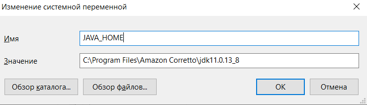
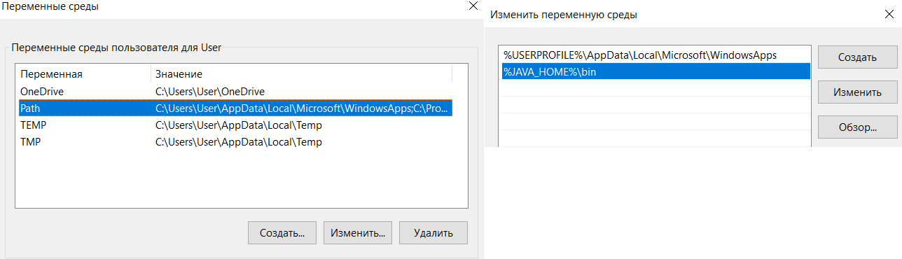

# java-reflect-status-of-orders
### short preview:
This app was developed for:
1. Handling data about orders;
2. Taking order's status back;
3. Returning set of criteria for reflect these statuses on front side.
## DESCRIPTION
1. This service (JavaReflectStatusOfOrdersApplication.class) is launched and waiting query from external client - query GET 
point (http://localhost:8080).
2. The service has got query (OrderController.class) and in his turn sending POST query direct to the
   external source, using (WebClientOkhttp.class), which ignore expired/inactive certificate from external service.
3. Response which the service has got in **XML format**, it put in method (getOrdersWithConfiguration) of general service
(OrderServiceImpl.class) and handling it there and return data in **JSON format** to the first client, which created and
sent GET query before (stage #1).

**Note:**
1. If with connection to external service turned out connection exception, the service will try to settle connection till to
   the success (WebClientOkhttp.class).
2. If external resource return empty string, service wait for 5 sec and will send query again till to not the success (OrderController.class).
3. If the service got inappropriate data for handling from external resource, service return as response NULL (OrderServiceImpl.class).

**P.S.:**
* Each GET query creates new instance of objects, thus it decided problem of multi queries and long time 
waiting response by every client.
* Configuration file (application.yml) which located in **"./src/main/resources"** contains next params:
1. Address of external resource;
2. Data for Authentication and Authorization process.
* Because this service firstly was created for own using, that's why there was added @CrossOrigin annotation for 
adding trusted url address of this client.

### Instruction for launch the app on Windows 10
1. Check that you have set java at least version 17, 
if not you can load this from official site: https://www.oracle.com/java/technologies/downloads/#jdk17-windows 
(x64 Installer), install it where system offers you.
2. Should set system variable **"JAVA_HOME"** and point path to path of environment variable. For that:
- press combination of key buttons "windows + R" and input "cmd" than enter **"SystemPropertiesAdvanced"** and press **"Enter"** on your keyboard.
- press "environment variables" in the right low corner.
- chose "system variables" **LOW PART** and add/create new variable **"JAVA_HOME"** and specify path for common folder with java. It can look like

- now there is needed to set path of this variable in "variables of environment "**HIGH PART**, but now we need to add direction **"\bin"**. Fot that we fall into "Path" and press button "add" or "create" and specify information about our variable. It has to look like than:

- it can be checked that all was done all right. For that in app "cmd.exe" enter command **"java -version"**. if everything is all right you can see your java version.
3. Compiling tool is "Maven", so it is necessary to download it and unpack archive in the same direction where was installed java (on the same level with common folder java).
- download archive from site: https://maven.apache.org/download.cgi (apache-maven-3.8.8-bin.tar.gz).
- create variable **"MAVEN_HOME"**, follow step №2.
- it can be checked that all was done all right. For that in app "cmd.exe" enter command **"mvn --version"**. if everything is all right you can see your maven version.
4. When java and maven installed correctly, it is becoming possible to collect this project and launch it.
- FIRST: set **url of external resource** and also **key for authorization** in application.yml file;
- SECOND: set body in class **"WebClientOkhttp.class"** \
***a)*** Launch file **"START_APP.bat"** \
***b)*** Or manually, using next commands:
- in **"cmd.exe"** to passing to directories which has **"pom.xml"** file, for that we input command **"cd (path for necessary folder)"** brackets is omitting.
- then input command **"mvn install"**
- now there was appeared folder **"target"**, so we're passing there, using command **"cd (path for necessary folder)"** brackets is omitting.
- then input command **"java -jar displayordersstatus-0.0.1-SNAPSHOT.jar"**.
5. If it is needs to stop accomplishing this app, input command **"jps -m"** and then kill necessary process using command **"taskkill /F /PID (ProcessID)"** brackets is omitting.
### Technology stack:
* Java: 17
* Spring Boot: 2.7.10
* OkHttp: 4.9.1
* Jackson: 2.12.5
* Project Lombok: 1.18.26